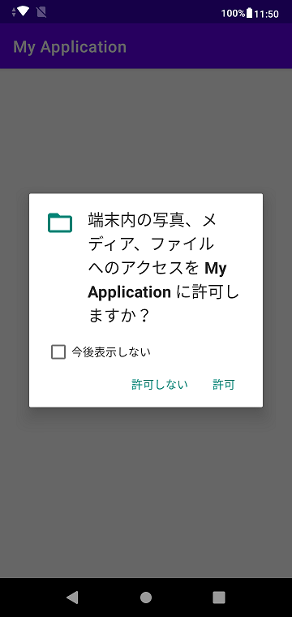

# update java sample

## deprecated requestPermissions(), onRequestPermissionsResult()

from "Empty Activity" by Andorid Studio 4.1.3

## confirmed
HTC HTL23 (Android 5.0.2)

Samsung Galaxy S7 edge (Andorid 7.0)

ASUS_X01AD(Android 9)

## article
https://www.remix.asia/blog/remix/2020/12/deprecated.html
